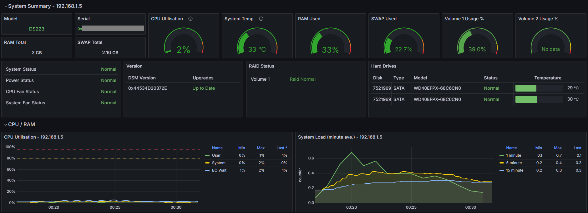

## Synology NAS Monitoring System

#### Overview
This monitoring system allows you to collect and visualize various metrics from your Synology NAS, including CPU usage, memory usage, disk status, RAID status, etc. The system uses SNMP (Simple Network Management Protocol) to collect data from the NAS, Prometheus for storing time-series data, and Grafana for creating dashboards and visualizations. The system is containerized using Docker and uses Nginx as a reverse proxy. The system can be run directly on the NAS itself as Docker containers, however my goal was to host it on a remote Linux virtual machine.

#### Components
- Docker: Platform used to containerize and manage the various services in this project.
- Nginx: Acts as a reverse proxy to route traffic to the appropriate services.
- Prometheus: Time-series database for storing metrics.
- Grafana: Visualization tool for creating dashboards and alerts.
- SNMP Exporter: Translates SNMP data from the Synology NAS into a format Prometheus can scrape.

#### Prerequisites
- A virtual Linux machine or a physical server to host the monitoring system
- Docker and Docker Compose installed on the host machine
- A Synology NAS with SNMP enabled and configured

