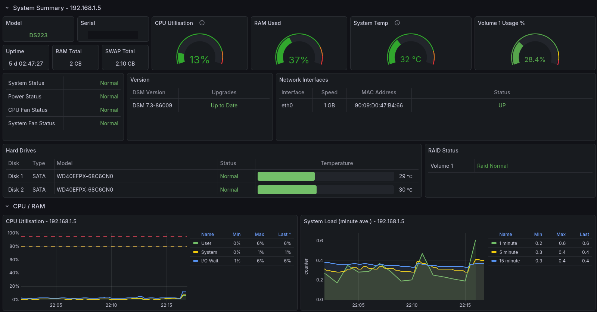

## Synology NAS Monitoring

Prometheus + Grafana + SNMP Exporter monitoring stack for Synology NAS, running directly on the NAS via Container Manager.

### Preview



### Stack

| Service | Image | Purpose |
|---|---|---|
| Prometheus | `prom/prometheus:v3.8.0` | Metrics collection and storage |
| Grafana | `grafana/grafana:12.3.3` | Visualization |
| SNMP Exporter | `prom/snmp-exporter:v0.25.0` | Translates SNMP OIDs to Prometheus metrics |
| Nginx | `nginx:1.28.2` | Reverse proxy, subpath routing |

### Prerequisites

- Synology DSM 7.x with Container Manager installed
- SNMP enabled on the NAS: **Control Panel → Terminal & SNMP → SNMP** → enable SNMPv1/v2c with community `public`

### Deployment

1. Clone the repo and copy the contents to `/volume1/monitoring` on the NAS.

2. Create the `.env` file:
   ```
   GF_ADMIN_PASSWORD=your_password_here
   ```

3. In Container Manager, create a new Project pointing to `/volume1/monitoring`. It will detect the `docker-compose.yml` and start all four containers.

### Dashboard

Uses Grafana dashboard [18643 - Synology SNMP](https://grafana.com/grafana/dashboards/18643-synology-snmp/) with minor adjustments which covers:

- System summary (model, serial, DSM version, uptime)
- CPU, RAM usage
- System and disk temperatures
- Storage volume usage
- Disk read/write throughput and IOPS
- Network traffic per interface
- RAID status

Import via Grafana → Dashboards → Import → ID `18643`.

## Notes

- SNMP Exporter is pinned to `v0.25.0` due to a breaking auth format change introduced in `v0.26.0`. Upgrading requires migrating `snmp.yml` to the new auth-split format. See the [migration guide](https://github.com/prometheus/snmp_exporter/blob/main/auth-split-migration.md).
- Nginx uses `proxy_pass http://grafana:3000` without a trailing slash to preserve the `/grafana/` subpath, which is required for `GF_SERVER_SERVE_FROM_SUB_PATH=true` to work correctly.
- Port `8080` is used because DSM's built-in Nginx occupies port `80`.